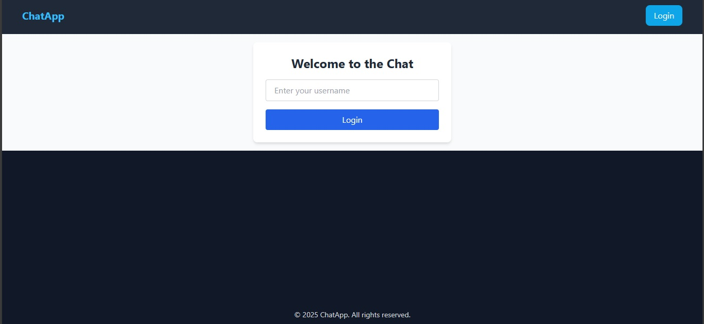
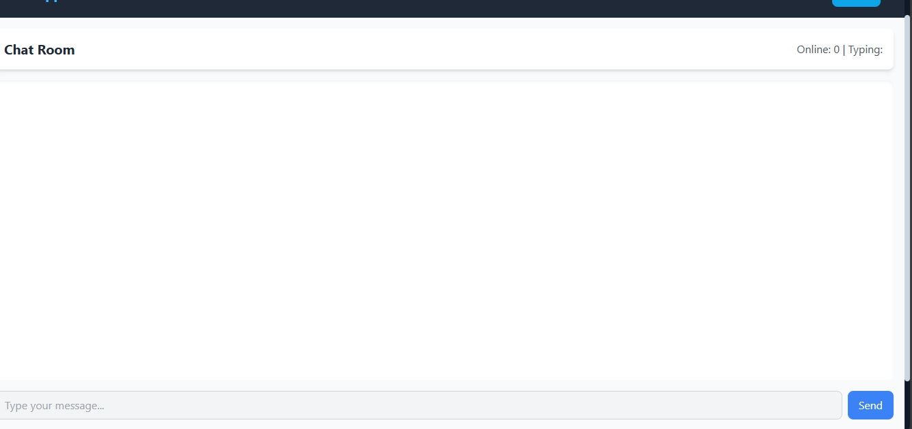

 Real-Time Chat Application with Socket.io


## Project Overview
This project is a real-time chat application built using **Node.js**, **Express**, **React**, and **Socket.io**. It allows multiple users to communicate in a global chat room, showing online users, typing indicators, and system notifications when users join or leave.

---


## Features Implemented

- Username-based login
- Global chat room
- Real-time message sending and receiving
- Online/offline status tracking
- Typing indicators
- System messages for user join/leave events
- Responsive UI with Navbar and Footer

---


## Setup Instructions


### Prerequisites
- Node.js v18+ installed


### Server Setup
1. Navigate to the server folder:
   ```bash
   cd server
Install dependencies:

bash
Copy code
npm install
Start the server:

bash
Copy code
npm start
Server runs on http://localhost:5000

Client Setup
Navigate to the client folder:

bash
Copy code
cd client
Install dependencies:

bash
Copy code
npm install
Start the client:

bash
Copy code
npm run dev
Client runs on http://localhost:5173


## Screenshots

### Homepage


### Login Page



Future Improvements
Private messaging

Multiple chat rooms

File/image sharing

Message reactions

Read receipts

Browser notifications


Notes
The application uses Tailwind CSS for styling.

Socket.io handles real-time communication.

System messages track user join/leave events.

yaml
Copy code
